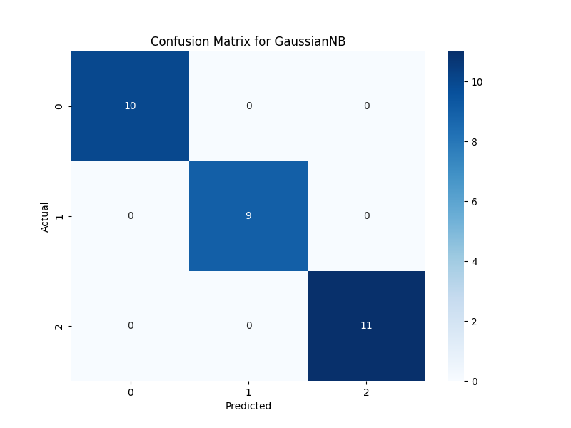
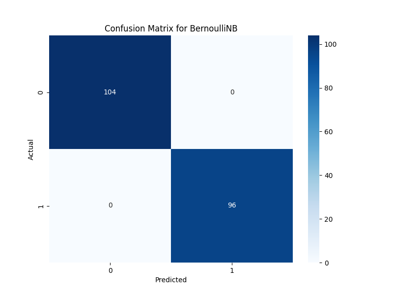

# Naive Bayes Classifier MLOps Project

This repository contains a comprehensive MLOps project demonstrating the implementation, training, and deployment of three types of Naive Bayes classifiers: Gaussian, Multinomial, and Bernoulli. The project is designed to be a showcase of MLOps best practices, including experiment tracking with MLflow and model serving with a FastAPI REST API.

## Table of Contents
- [Naive Bayes Algorithms: A Deep Dive](#naive-bayes-algorithms-a-deep-dive)
  - [Core Concept: Bayes\' Theorem](#core-concept-bayes-theorem)
  - [The "Naive" Assumption](#the-naive-assumption)
  - [1. Gaussian Naive Bayes](#1-gaussian-naive-bayes)
  - [2. Multinomial Naive Bayes](#2-multinomial-naive-bayes)
  - [3. Bernoulli Naive Bayes](#3-bernoulli-naive-bayes)
- [Industry Use Cases](#industry-use-cases)
- [Project Structure](#project-structure)
- [Installation Guide](#installation-guide)
- [Usage](#usage)
  - [Step 1: Generate the Dataset](#step-1-generate-the-dataset)
  - [Step 2: Train the Models](#step-2-train-the-models)
  - [Step 3: Serve the Model via API](#step-3-serve-the-model-via-api)
  - [Step 4: Test the Prediction Endpoint](#step-4-test-the-prediction-endpoint)
- [Results and Evaluation](#results-and-evaluation)
- [Contributing](#contributing)
- [License](#license)

## Naive Bayes Algorithms: A Deep Dive

Naive Bayes classifiers are a family of simple, yet powerful, probabilistic algorithms based on applying Bayes\' theorem with a strong "naive" assumption of conditional independence between features.

### Core Concept: Bayes' Theorem

The foundation of Naive Bayes is Bayes\' Theorem, which describes the probability of an event based on prior knowledge of conditions that might be related to the event. The formula is:

$$ P(A|B) = {P(B|A) * P(A) \over P(B)} $$

Where:
- **P(A|B)**: **Posterior Probability**. The probability of hypothesis A being true, given that event B has occurred.
- **P(B|A)**: **Likelihood**. The probability of event B occurring, given that hypothesis A is true.
- **P(A)**: **Prior Probability**. The initial probability of hypothesis A being true.
- **P(B)**: **Marginal Likelihood**. The probability of event B occurring.

In the context of classification, the formula is rewritten as:

$$ P(y|x_1, ..., x_n) = {P(x_1, ..., x_n|y) * P(y) \over P(x_1, ..., x_n)} $$

### The "Naive" Assumption

The "naive" part of the algorithm is the assumption that every feature is independent of every other feature, given the class `y`. This is a strong assumption that is often not true in the real world, but it simplifies the computation dramatically. With this assumption, the likelihood `P(x_1, ..., x_n|y)` can be decomposed into the product of the individual probabilities:

$$ P(x_1, ..., x_n|y) \approx \prod_{i=1}^{n} P(x_i|y) $$

This simplification is what makes Naive Bayes so efficient.

---

### 1. Gaussian Naive Bayes

**Concept:**
Gaussian Naive Bayes is used when the features are continuous (e.g., height, weight, temperature). It assumes that the values associated with each class are distributed according to a Gaussian (or Normal) distribution.

**Mathematical Deduction:**
The probability of a given feature `x_i` for a class `y` is calculated using the Gaussian probability density function:

$$ P(x_i|y) = {1 \over \sqrt{2\pi\sigma_y^2}} * \exp(-{(x_i - \mu_y)^2 \over 2\sigma_y^2}) $$

Where `μ_y` (mean) and `σ_y` (standard deviation) are calculated from the training data for each class `y`.

**Use Cases:**
- **Medical Diagnosis:** Predicting disease based on continuous features like blood pressure, glucose levels, etc.
- **Spam Detection:** If features like "average number of capital letters" or "email length" are used.
- **Sentiment Analysis:** Using features like the average word length or punctuation density.

---

### 2. Multinomial Naive Bayes

**Concept:**
Multinomial Naive Bayes is primarily used for discrete data, making it a staple for text classification problems. It models the probability of observing a specific feature (e.g., a word) a certain number of times in a document.

**Mathematical Deduction:**
The probability of a feature vector `x` for a class `y` is calculated based on the frequency of features (words):

$$ P(x|y) = {\frac{(\sum_i x_i)!}{\prod_i x_i!}} \prod_i {P(x_i|y)}^{x_i} $$

In practice, this is simplified using log-probabilities and feature counts (e.g., TF-IDF or word counts). The likelihood `P(x_i|y)` is estimated as:

$$ P(x_i|y) = {\text{count}(x_i, y) + \alpha \over \text{total features in class } y + \alpha \cdot n} $$

Where `α` is a smoothing parameter (usually 1, for Laplace smoothing) to handle words not seen in the training data, and `n` is the number of features.

**Use Cases:**
- **Text Classification:** The most common use case. Examples include spam filtering, sentiment analysis, and topic categorization.
- **Document Classification:** Categorizing articles, news, or scientific papers.

---

### 3. Bernoulli Naive Bayes

**Concept:**
Bernoulli Naive Bayes is another variant used for discrete data, but it only considers the presence or absence of a feature, not its frequency. Each feature is treated as a binary variable (it occurs or it doesn't).

**Mathematical Deduction:**
The likelihood `P(x_i|y)` is the probability that feature `x_i` is present in a document of class `y`. For a feature vector `x`, the probability for a class `y` is:

$$ P(x|y) = \prod_{i=1}^{n} P(x_i|y)^{x_i} (1 - P(x_i|y))^{(1 - x_i)} $$

This is essentially calculating the probability of a feature being present and the probability of other features being absent.

**Use Cases:**
- **Text Classification:** Particularly effective when the presence of a specific word is more important than how many times it appears (e.g., classifying a review as "spam" if it contains the word "free," regardless of frequency).
- **Spam Filtering:** Similar to Multinomial, but focused on whether certain spammy words appear at all.

## Industry Use Cases

- **Real-time Prediction:** Due to its speed and low computational requirements, Naive Bayes is excellent for making real-time predictions.
- **Text Classification / Spam Filtering:** Gmail, Yahoo, and other email providers use Naive Bayes classifiers to categorize emails as spam or not spam.
- **Recommendation Systems:** It can be used in collaborative filtering to recommend products or articles that users might like, by classifying users based on their past behavior.
- **Medical Diagnosis:** Classifying patients as having a certain disease or not based on their symptoms (features).

## Project Structure

```
.
├── data/
│   ├── generate_data.py        # Script to generate synthetic text data
│   └── synthetic_text_data.csv # The generated dataset
├── models/                     # Directory for saved model artifacts
├── plots/                      # Directory for saved evaluation plots
├── utils/
│   └── io_utils.py             # Utility functions for file I/O
├── .gitignore
├── LICENSE
├── README.md                   # This file
├── requirements.txt            # Project dependencies
├── serve_fastapi.py            # FastAPI script for model serving
└── train.py                    # Main script for model training and evaluation
```

## Installation Guide

1.  **Clone the repository:**
    ```bash
    git clone <your-repository-url>
    cd naive_bayes
    ```

2.  **Create a virtual environment (recommended):**
    ```bash
    python -m venv venv
    source venv/bin/activate  # On Windows, use `venv\Scripts\activate`
    ```

3.  **Install the dependencies:**
    ```bash
    pip install -r requirements.txt
    ```

## Usage

Follow these steps to run the project.

### Step 1: Generate the Dataset

First, generate the synthetic text data that will be used to train the Multinomial and Bernoulli models.

```bash
python data/generate_data.py
```
This will create the `synthetic_text_data.csv` file in the `data/` directory.

### Step 2: Train the Models

Next, run the training script. This will train all three Naive Bayes models, log experiments to MLflow, and save the resulting models and evaluation plots.

**Prerequisite:** Make sure you have an MLflow tracking server running. You can start one easily:
```bash
mlflow ui
```
By default, it runs at `http://127.0.0.1:5000`, which is the URI configured in the training script.

**Run the training:**
```bash
python train.py
```
After running, you will find the trained models (`.joblib` files) in the `models/` directory and the confusion matrix plots in the `plots/` directory.

### Step 3: Serve the Model via API

The `serve_fastapi.py` script launches a web server to provide predictions from the latest trained Multinomial Naive Bayes model.

**Run the server:**
```bash
uvicorn serve_fastapi:app --reload
```
The API will be available at `http://127.0.0.1:8000`. You can access the interactive API documentation at `http://127.0.0.1:8000/docs`.

### Step 4: Test the Prediction Endpoint

You can send a `POST` request to the `/predict` endpoint to get a classification for a piece of text.

<details>
<summary>Using `curl` (Linux/macOS/WSL)</summary>

```bash
curl -X POST "http://127.0.0.1:8000/predict" \
-H "Content-Type: application/json" \
-d '{"text": "This is a sample sentence about category A"}'
```

</details>

<details>
<summary>Using PowerShell (Windows)</summary>

In PowerShell, `curl` is an alias for `Invoke-WebRequest`, which uses a different syntax.

```powershell
Invoke-WebRequest -Uri "http://127.0.0.1:8000/predict" `
  -Method POST `
  -ContentType "application/json" `
  -Body '{"text": "This is a sample sentence about category A"}'
```

</details>

**Expected Response:**
```json
{
  "prediction": "0",
  "model_used": "multinomial_nb_xxxxxxxxxx.joblib",
  "vectorizer_used": "multinomial_nb_vectorizer_xxxxxxxxxx.joblib"
}
```

## Results and Evaluation

The performance of each model is evaluated using standard classification metrics. The confusion matrix provides a clear visual representation of how each classifier performs.

### Gaussian Naive Bayes (Iris Dataset)


### Multinomial Naive Bayes (Synthetic Text)


### Bernoulli Naive Bayes (Synthetic Text)


The metrics (Accuracy, Precision, Recall, F1-Score) for each run are logged to **MLflow**, where you can compare the performance of different models and experiments.

## Contributing

Contributions are welcome! Please feel free to submit a pull request or open an issue to discuss any changes.

## License

This project is licensed under the terms of the LICENSE file.